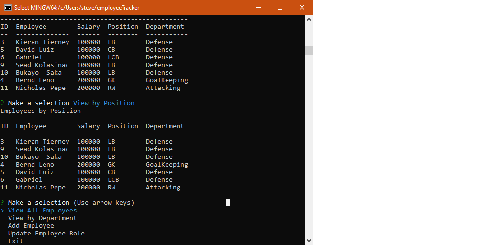
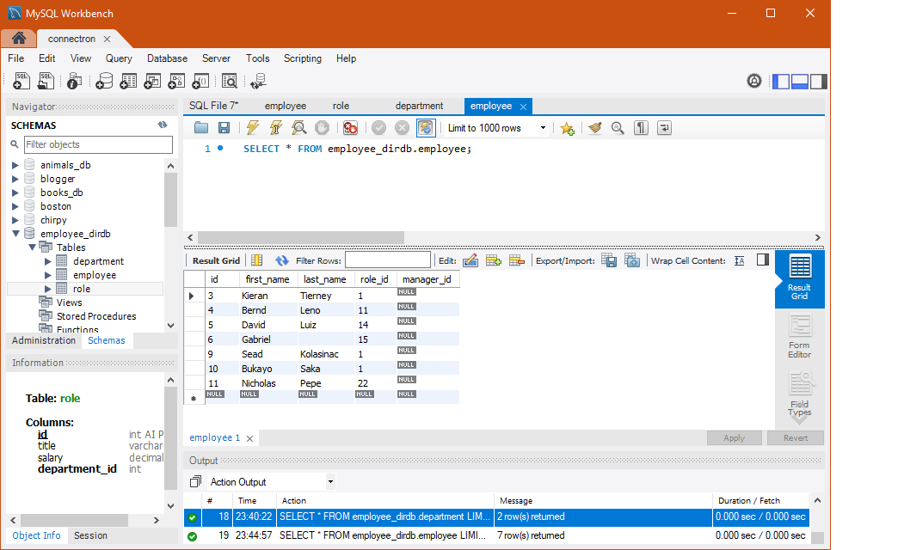

# Employee Tracker

## Description 
  Command line app that utilizes the joining of 3 tables in a mysql database.
 ### Images
 
 
 ### Screencastify
 [Walk through video](https://drive.google.com/file/d/10u4XLlD8VB1dZpI67GHtb0gpcBetiNO7/view?usp=sharing)
## Table of contents 
 - [Installation](#installation) 
 - [Usage](#usage) 
 - [contributing](#contributing) 
 - [Tests](#tests) 
## Installation 
 Git pull, or download.
## Usage 
 Start MySql connection and use schema and seeds to build database. Run server.js in Node and follow prompts.
## License 
 
## Contributing 
 Steven Schaab 
## Tests 
 N/A 
## Questions 
 - [Github](https://github.com/Raygun2thehead) 
 - [Email](mailto:stevenes83@gmail.com)
